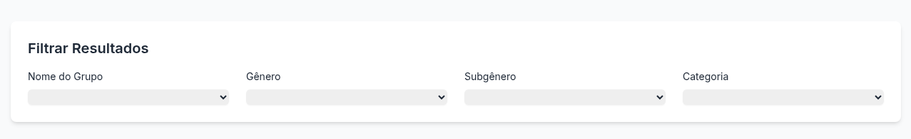
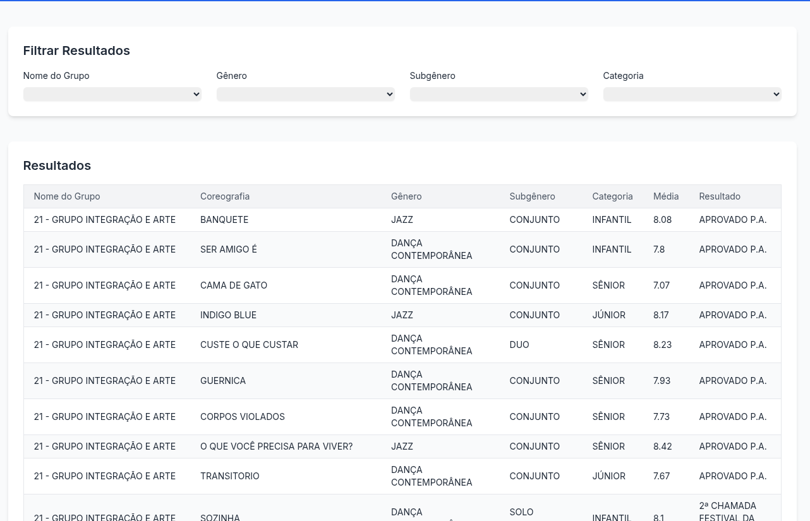

# Festival Ranking

## Description

This repository contains a project with a crawler to get Joinville Dancing Festival and save it in the database. This project was necessary, because there
aren't better way to filter those information about classification and ranking. In this project you are able to search by:
- Group name
- Genre
- Subgenre
- and Category

As show below:


## Features
- Java 24
- SQLite
- Spring Boot 3.4.5
- Jsoup (Crawler)

## How to start

Run the command:

```shell
$ make start
```

You can start the project with native image with the command:

```shell
$ make native-start
```

With Native Image, applications can run faster, use less memory, and be more secure as
shown [here](https://github.com/valdemarjuniorr/spring-boot-graalvm-performance-comparation).

## How to use

After starting the application, you need to collect the data clicking in the URL http://localhost:8080/process, then it will create a database file called `festival-ranking.db`. 
After that, only access http://localhost:8080 and it will show the screen below:



And now you will be able to filter as you like!